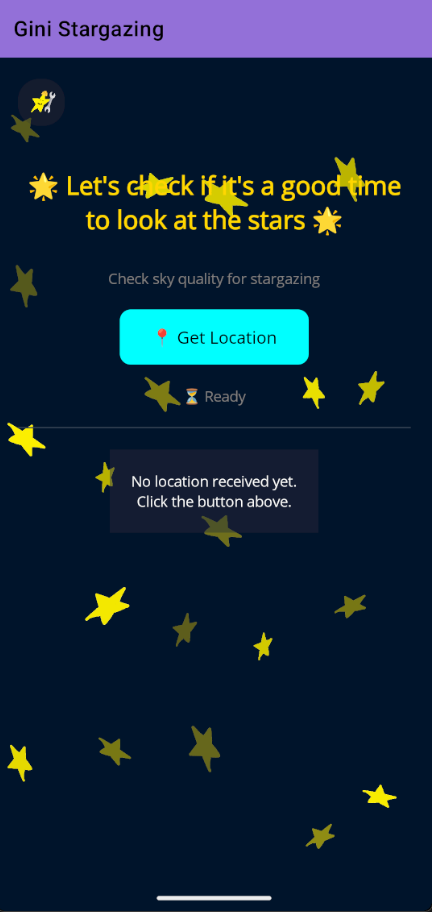
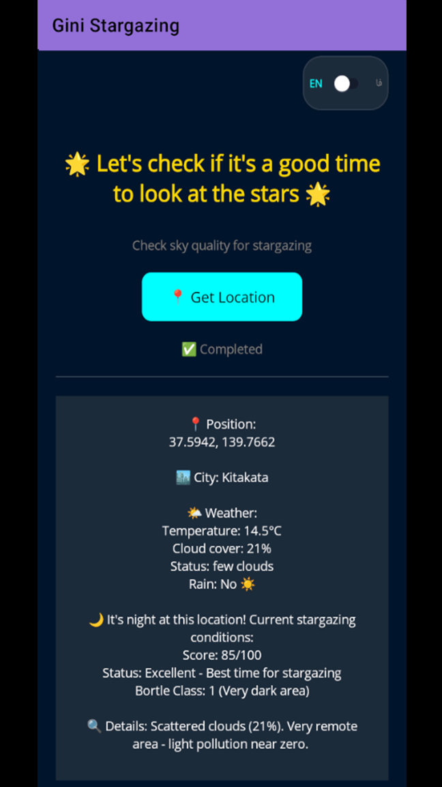
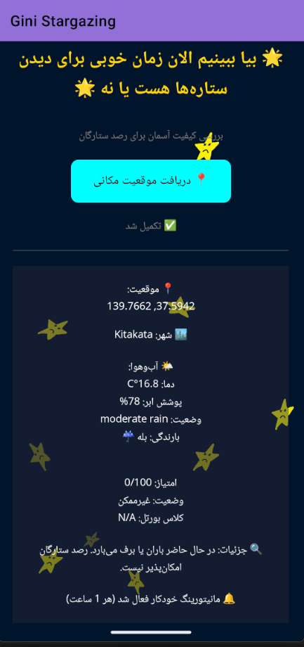
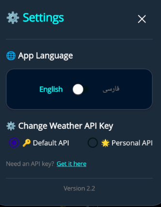

# Gini Stargazing | جینی: رصد ستارگان

**Calculate night sky quality and find the perfect time for stargazing.**
**محاسبه کیفیت آسمان شب و یافتن بهترین زمان برای رصد ستارگان.**

**[🌍 English](#-english)** | **[🇮🇷 فارسی](#-فارسی)**

---

# 🌍 English

## 📖 About
**Gini** is an Android application built with .NET MAUI that helps amateur astronomers, astrophotographers, and nature lovers determine if the night sky is ready for stargazing. By analyzing real-time weather data, cloud cover, and local light pollution, it calculates a comprehensive **Sky Quality Score** (0–100) and the standard **Bortle Class** (1–9).

Whether you're planning a telescope session or a naked-eye meteor shower watch, Gini gives you an instant, science‑based go/no‑go recommendation.

## ✨ Features
- ⭐ **Sky Quality Score:** Real-time calculation from 0 (worst) to 100 (pristine).
- 🌃 **Bortle Scale:** Accurate light pollution classification (Class 1 – Excellent Dark Sky, to Class 9 – Inner-city Sky).
- ☁️ **Live Weather:** Temperature, cloud cover, humidity, and precipitation probability via OpenWeatherMap.
- 🌅 **Day/Night Detection:** Precise sunrise, sunset, and astronomical twilight times using server time and coordinates.
- 🏙️ **City Impact:** Identifies nearby cities (up to 100 km) using OpenStreetMap and calculates their individual light pollution contribution based on population and distance.
- 🌐 **Bilingual UI:** Full support for Persian (Farsi) and English, including RTL layout.
- 🧭 **Location Services:** Uses device GPS or manual coordinate entry.
- 📊 **Live Score Breakdown:** See exactly how each factor (clouds, Moon, light domes) affects the final quality.
- 🔔 **Night Monitoring:** Automatically monitors sky quality every hour during nighttime and delivers push notifications with the latest score — so you never miss a clear sky window.
- ⚙️ **Settings Panel:** Fully redesigned settings overlay with language toggle and custom API key management.
- 🔑 **Custom API Key:** Use your own OpenWeatherMap API key for higher rate limits and reliability, with built-in key validation before saving.

## 🛠️ Tech Stack
- **Framework:** .NET MAUI (net10.0-android)
- **Language:** C# 12
- **Architecture:** Code-Behind
- **APIs:**
  - [OpenWeatherMap](https://openweathermap.org/) – Weather and astronomy data (One Call API 3.0)
  - [OpenStreetMap](https://www.openstreetmap.org/) – Nominatim and Overpass API

## 📸 Screenshots

  

## 📥 Installation
1. Download the latest APK from the [Releases](https://github.com/siroos0000/StargazingApp/releases/tag/v2.2.0) page.
2. Enable "Install from unknown sources" on your Android device if required.
3. Install and grant location and notification permissions when prompted.

## 🚀 Usage
- Open the app.
- Tap the **"Get Your Location"** button.
- Allow location and notification access when prompted.
- Wait while the app:
  - Gets your GPS position
  - Fetches weather data from the server
  - Calculates sky quality
- The result shows sky quality score, Bortle class, and details.
- If it's nighttime, **monitoring activates automatically** and sends hourly notifications.
- Tap the ⚙️ settings icon to switch language or manage your API key.

## ⚙️ Settings
- **Language:** Switch between English and Persian (Farsi) at any time — the entire UI updates instantly including RTL layout.
- **API Key:** Choose between the built-in default API key or enter your own OpenWeatherMap key. The app validates the key against the API before saving, so you always know it works.

## 🤝 Contributing
Pull requests are welcome! For major changes, please open an issue first to discuss what you would like to change.
If you enjoy the project, give it a ⭐ on GitHub!

## 📄 License
No license is currently assigned to this project. All rights reserved until further notice.
*This may change in future releases.*

---

# 🇮🇷 فارسی

## 📖 درباره
**جینی** یک اپلیکیشن اندرویدی ساخته‌شده با NET MAUI. است که به منجمان آماتور، عکاسان نجومی و علاقه‌مندان به طبیعت کمک می‌کند تشخیص دهند آسمان شب برای رصد آماده است یا خیر. این برنامه با تحلیل داده‌های زندهٔ آب‌وهوا، میزان پوشش ابر و آلودگی نوری محل، یک **امتیاز کیفیت آسمان** (۰ تا ۱۰۰) و **کلاس بورتل** استاندارد (۱ تا ۹) را محاسبه می‌کند.

چه برای رصد با تلسکوپ برنامه‌ریزی کنید چه برای تماشای یک بارش شهابی با چشم غیرمسلح، جینی در لحظه به شما یک توصیهٔ علمی و قاطع می‌دهد.

## ✨ ویژگی‌ها
- ⭐ **امتیاز کیفیت آسمان:** محاسبهٔ لحظه‌ای از ۰ (بدترین) تا ۱۰۰ (بی‌نظیر).
- 🌃 **مقیاس بورتل:** طبقه‌بندی دقیق آلودگی نوری (کلاس ۱ – آسمان کاملاً تاریک، تا کلاس ۹ – آسمان درون‌شهری).
- ☁️ **آب‌وهوای زنده:** دما، پوشش ابر، رطوبت و احتمال بارش با استفاده از OpenWeatherMap.
- 🌅 **تشخیص شب/روز:** محاسبهٔ دقیق طلوع، غروب و گرگ و میش نجومی با استفاده از زمان سرور و مختصات.
- 🏙️ **تأثیر شهرها:** شناسایی شهرهای نزدیک (تا شعاع ۱۰۰ کیلومتر) با OpenStreetMap و محاسبهٔ تأثیر آلودگی نوری هر شهر بر پایهٔ جمعیت و فاصله.
- 🌐 **رابط کاربری دوزبانه:** پشتیبانی کامل از فارسی و انگلیسی (شامل چینش راست‌به‌چپ).
- 🧭 **خدمات مکان‌یابی:** استفاده از GPS دستگاه یا ورود دستی مختصات.
- 📊 **جزئیات امتیاز:** مشاهدهٔ سهم دقیق هر عامل (ابر، ماه، گنبدهای نوری) در امتیاز نهایی.
- 🔔 **مانیتورینگ شبانه:** در طول شب، هر ۱ ساعت یک‌بار کیفیت آسمان به‌صورت خودکار محاسبه شده و از طریق نوتیفیکیشن به شما اطلاع داده می‌شود — تا هیچ پنجرهٔ صاف و زیبایی را از دست ندهید.
- ⚙️ **پنل تنظیمات:** صفحهٔ تنظیمات با طراحی کاملاً جدید، شامل تغییر زبان و مدیریت API Key.
- 🔑 **API Key شخصی:** امکان استفاده از کلید API شخصی OpenWeatherMap با قابلیت اعتبارسنجی خودکار قبل از ذخیره.

## 🛠️ فناوری‌ها
- **فریم‌ورک:** NET MAUI. (net10.0-android)
- **زبان برنامه‌نویسی:** C# 12
- **معماری:** Code-Behind
- **رابط‌های برنامه‌نویسی (API):**
  - [OpenWeatherMap](https://openweathermap.org/) – داده‌های هواشناسی و نجوم (One Call API 3.0)
  - [OpenStreetMap](https://www.openstreetmap.org/) – Nominatim و Overpass API

## 📸 تصاویر برنامه

  

## 📥 نصب
۱. آخرین نسخهٔ APK را از صفحهٔ [Releases](https://github.com/siroos0000/StargazingApp/releases/tag/v2.2.0) دانلود کنید.
۲. در صورت لزوم، نصب از منابع ناشناس را در دستگاه اندرویدی خود فعال کنید.
۳. برنامه را نصب کرده و مجوز مکان و نوتیفیکیشن را هنگام درخواست بدهید.

## 🚀 روش استفاده
- برنامه را باز کنید.
- روی دکمه **"دریافت موقعیت شما"** ضربه بزنید.
- اجازه دسترسی به موقعیت مکانی و نوتیفیکیشن را بدهید.
- منتظر بمانید تا برنامه:
  - موقعیت GPS شما را دریافت کند
  - اطلاعات آب‌وهوا را از سرور بگیرد
  - کیفیت آسمان را محاسبه کند
- نتیجه شامل امتیاز کیفیت آسمان، کلاس بورتل و جزئیات نمایش داده می‌شود.
- در صورتی که شب باشد، **مانیتورینگ به‌صورت خودکار فعال می‌شود** و هر ساعت نوتیفیکیشن ارسال می‌کند.
- روی آیکون ⚙️ بزنید تا تنظیمات زبان یا API Key را مدیریت کنید.

## ⚙️ تنظیمات
- **زبان:** در هر لحظه بین فارسی و انگلیسی تغییر دهید — تمام رابط کاربری از جمله چینش راست‌به‌چپ فوری به‌روز می‌شود.
- **API Key:** بین کلید پیش‌فرض داخلی یا کلید شخصی OpenWeatherMap خود انتخاب کنید. برنامه قبل از ذخیره، اعتبار کلید را به‌صورت خودکار چک می‌کند.

## 🤝 مشارکت
درخواست‌های Pull Request با آغوش باز پذیرفته می‌شوند! برای تغییرات بزرگ، لطفاً ابتدا یک Issue باز کنید تا در مورد آن گفتگو کنیم.
اگر از پروژه لذت می‌برید، با دادن یک ⭐ در گیت‌هاب از ما حمایت کنید!

## 📄 مجوز
در حال حاضر هیچ مجوزی برای این پروژه تعیین نشده است. کلیه حقوق محفوظ است تا اطلاع ثانوی.
*ممکن است در نسخه‌های آینده تغییر کند.*
